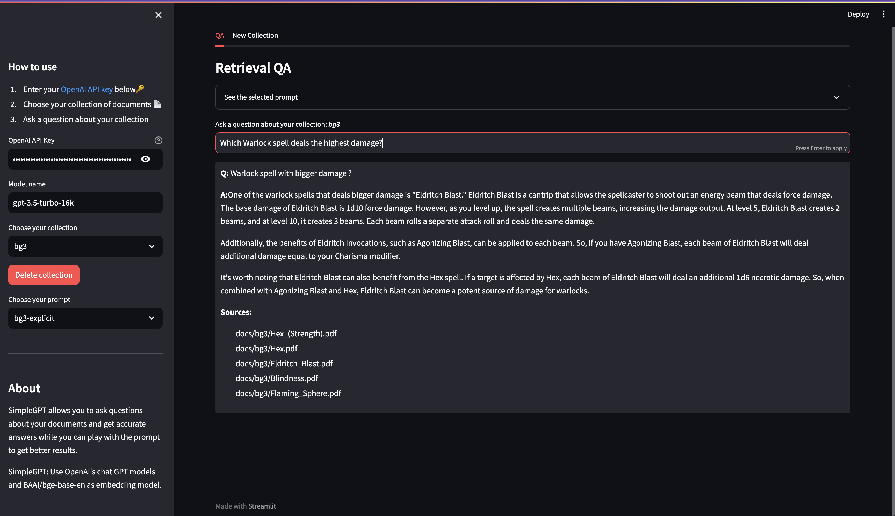

# 📖 Chatting with Docs: A Learning Journey with AI

Hey there! I've been dabbling with Langchain and ChromaDB to chat about some documents, and I thought I'd share my experiments here. It's all pretty new to me, but I'm excited about where it's headed.

This project serves as an ultra-simple example of how Langchain can be used for RetrievalQA for documents, currently using ChatGPT as a LLM.

## ✨ Current Features:

* Langchain Chats: I've been playing with Langchain to chat about some docs, and it's pretty fun!
* Models: I am using ChatGPT as LLM model and `bge-base-en` as the embedding model.
* ChromaDB Storage: I'm using ChromaDB to keep the document vectors. It seems to work well for this purpose.
* My Little and Simple Scrapers: Right now, I've got a couple of simple scrapers for AWS FAQs and Baldur’s Gate 3 a great game. Just the start of my data adventures!

## 🌱 What's Next?

Honestly, I'm still figuring things out. But I do hope to add a few more scrapers and see where this goes.

If you're curious or have some friendly tips, feel free to drop a message or a suggestion. Always happy to learn and chat! 😄

## Installation

First clone the repository to your local machine.

```bash
git clone git@github.com:douglasmakey/chatting-with-docs.git
```

Then navigate into the project directory and install the dependencies.

```bash
cd chatting-with-docs
pip install -r requirements.txt
```

## Usage

The project provides two main commands: `feed`, `scraping` and `app`.

### Scraping Command

The `scraping` command is used to scrape websites using the internal scraper implementations provided by the project.

```bash
# BG3 because YOLO !!
python main.py scraping --target bg3 --output-dir "docs/bg3"
```

### Feed Command

The `feed` command allows you to feed documents into a ChromaDB database. Here's how to use it:

```bash
python main.py feed --from-path <path> --collection-name <name> --split-documents
```
- from-path: Path to the folder with the documents.
- collection-name: The name of the collection to create.
- split-documents: Split documents into chunks (optional).
- data-type: The type of data to feed (default: pdf) (optional).
- chromadb-persitent-path: The path to the ChromaDB persistent storage (default: db) (optional).

### App Command

```bash
python main.py app
```

### Examples

```bash
# Feed documents from a folder
python main.py feed --from-path /path/to/documents --collection-name my_collection

# Feed pdf documents from a folder and split them into chunks
python main.py feed --from-path /path/to/documents --collection-name my_collection --split-documents

# Feed text documents from a folder
python main.py feed --from-path /path/to/documents --collection-name my_collection --data-type txt

# Feed with the documents from BG3 scraper
python main.py feed --from-path /docs/bg3 --collection-name bg3 --no-split-documents

# Run the Streamlit app
python main.py app
```
## Screenshots



## Contribution

Feel free to submit issues or pull requests. Your contributions are appreciated!

## License

This project is licensed under the MIT License.